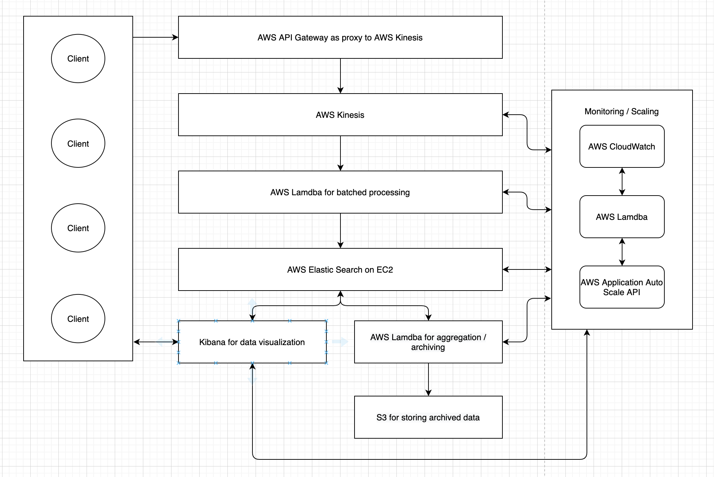

# PaytmLabs SDE Challenge

## Coding Question

Write an interface for a data structure that can provide the moving average of the last N elements added, add elements to the structure and get access to the elements. Provide an efficient implementation of the interface for the data structure.

### Minimum Requirements

1. Provide a separate interface (IE `interface`/`trait`) with documentation for the data structure
2. Provide an implementation for the interface
3. Provide any additional explanation about the interface and implementation in a README file.

### Solution
1. Interface for moving average calculator is provided in [moving-average.ts](https://github.com/bobzhou/SDEChallenge/blob/master/moving-average.ts)
2. Implementation of the interface is located in [index.ts](https://github.com/bobzhou/SDEChallenge/blob/master/index.ts)
3. installation
```
  - require NodeJS v10+
  - npm install
  - npm start
```

## Design Question

Design A Google Analytic like Backend System.
We need to provide Google Analytic like services to our customers. Please provide a high level solution design for the backend system. Feel free to choose any open source tools as you want.

### Requirements

1. Handle large write volume: Billions of write events per day.
2. Handle large read/query volume: Millions of merchants wish to gain insight into their business. Read/Query patterns are time-series related metrics.
3. Provide metrics to customers with at most one hour delay.
4. Run with minimum downtime.
5. Have the ability to reprocess historical data in case of bugs in the processing logic.

### Solution



### Services
#### AWS API Gateway
This service is a restful interface in which our clients push the events to using HTTP requests. API gateway supports WebSockets and HTTP requests, can be used to push events or stream events from clients depending on needs. This AWS service have limitless scaling and can be deployed on multiple region, it's perfect for our need to scale heavy traffic across multiple clients, devices, and regions. 
API Gateway supports [canary release](https://docs.aws.amazon.com/apigateway/latest/developerguide/canary-release.html), allowing us to safely deploy to our API and test out changes without affecting production. Which is perfect for our zero downtime requirement. 
API Gateway can be configured as a proxy for AWS Kinesis which is what we will be using for capturing all our analytics events prior to processing.

### AWS Kinesis
Amazon Kinesis is a massively scalable and durable real-time data streaming service. We can use this service to capture our analytical events prior to being processed. I chose this service for its high throughput writes. A single stream with 2500 shards can handle 5,000,000 records/second or 5000 MB/second. That is over 400 billion requests per day on a single stream. We can even read at twice the throughput for data aggregation, giving us near real-time performance on our analytics. 

### AWS Lamdba
AWS Lambda is a servicer less framework with continuous scaling. Again I chose this service based on the scalability, and it pairs nicely with Kinesis. We can setup Lamdba to scale based on the amount of queued events in Kinesis with AWS's auto-scaling. 
On Lamdba is where we will write our function for batched processing of our queued up events in Kinesis. Being able to do batched processing is very important for us because we don't want the same level of throughput to our data storage service as our data capturing service. Being able to batch process events let us reduce the write throughput needs of our data storage by a factor of 1000s.

### Elastic Search
Elasticsearch is a highly scalable open-source full-text search and analytics engine. It allows us to store, search, and analyze big volumes of data quickly and in near real-time. It is the perfect underlying engine/technology that can power an analytics service with lots of data. We are deploying Elastic on our EC2 cluster. 

### AWS Lamdba
Here we have another set of AWS Lambda functions that we deploy. The purpose of these Lambdas is to aggregate and archive the data we have stored in Elastic Search. Being able to quickly search through all the records in Elastic Search is great but it's not practical for our clients. They need aggregate data to see performance in time intervals. This is where the Lamdba function comes in, we can setup Lambdas to create aggregates based on useful time intervals (hourly, daily, weekly..) and store those aggregate data back into Elastic Search. 

### Kibana
Data is only useful if our client can visualize them, that's where Kibana comes in. Kibana is an open-source data visualization and exploration tool used for log and time-series analytics, application monitoring, and operational intelligence use cases. Kibana sits nicely on top of Elastic Search, clients can create custom charts and diagrams to tailor to their own needs.

### Monitoring / Scaling
I chose to keep all the services on AWS so we can easily monitor and scale all our services simultaneously. All of our services are monitored by CloudWatch which can set up to automatically trigger Lamdba functions based on the service's load/health. We can access the AWS Application Auto Scaling API to adjust the size of our cluster, throughput, sharding, and scaling of all our services. CloudWatch also provides us with insight and monitoring of the health and traffic of all our services so we can quickly fix any issue if any should arise. 
